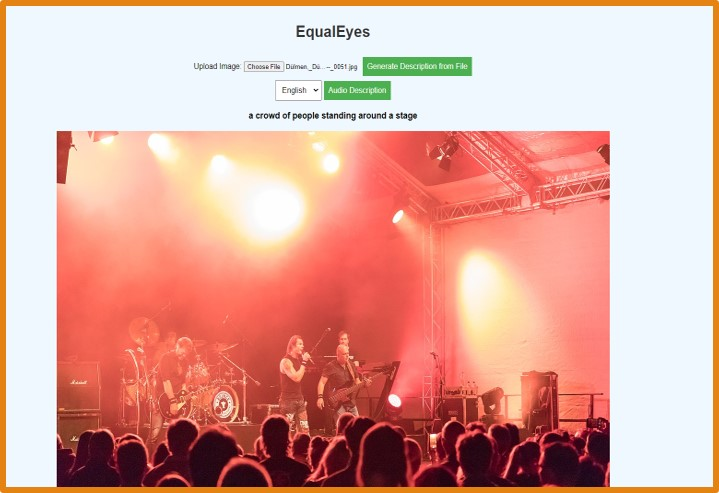

# **EqualEyes: Image Caption Generator**

## **Team**
- Shashank Guda (POC)
 https://github.com/gudashashank
- Soundarya Ravi
 https://github.com/soravi18
- Ramya Chowdary Patchala
 https://github.com/ramyacp14 
- Rithika Gurram
https://github.com/Rithika2000
- Vishnu Charugundla
https://github.com/VishnuCharugundla

### **Introduction**

The project aims to push image captioning technology beyond what currently exists. We will combine recent advances in image recognition and language modeling to generate novel descriptive captions that go beyond just naming objects and actions. The goal is a system that provides rich, detailed, and natural descriptions of photographs to make them more accessible and meaningful for all. Training on open and varied image datasets will be key to ensuring the system can generalize well and avoid bias. We will also prioritize evaluation methods that measure how well the captions describe the full context of images, not just presence of objects. There are still some challenges ahead, but by focusing on inclusivity and the uniqueness of this multi-modal approach, we hope to create something that moves image captioning technology forward in an impactful way.

The objective of *EqualEyes* is to be helpful for anyone who interacts with images and relies on captions to understand the content better. This includes individuals with visual impairments who use screen readers (especially the color blind people), people browsing social media platforms or news websites, researchers analyzing image datasets, and developers working on applications that involve image recognition and understanding. Ultimately, the goal is to make image captioning more inclusive and accessible for all users, regardless of their abilities or needs.

The primary stakeholders for this project include individuals with visual impairments and educators. Successful implementation of the system will significantly improve accessibility for individuals using screen readers and provides valuable educational resources for teachers and educators.

The working web application takes an image in any format as an input, processes it through our 4th model VisionEncoderDecoder Model, a descriptive caption is generated for that image, further it has an audio extension which helps Visually Impaired People to listen to the description of an image through medium of sound. For now we have established for the standard American english.

#### **Outlining Stakeholders**

**1. Individuals with Visual Impairments:**
- Individuals who rely on screen readers to access image content.
- Accessible and descriptive image captions that accurately convey the content and context of images, enabling them to comprehend visual information effectively.

**2. Social Media Users:**
- Users of social media platforms such as Instagram, Twitter, and Facebook.
- Engaging and informative image captions that enhance the browsing experience and facilitate better understanding of shared images.

**3. Teachers and Educators:**
- Professionals involved in educating their peers, including those who train other teachers in the effective use of technology in the classroom. 
- It creates an engaging learning experience, supports early literacy with younger children where it makes learning fun, it also improves the language learning, it can provide additional vocabulary to the peers,highly useful in bilingual or multilingual classroom environments.

## **Literature Review**

Microsoft Research has developed a system that generates detailed captions for real-world images by combining powerful image recognition with tools for generating, ranking and contextualizing captions. The system utilizes a state-of-the-art image recognition model to understand image content. It can also identify celebrities and landmarks to create richer, more informative captions. Testing shows the system outperforms previous ones, especially for images from diverse sources like Instagram. This research represents a major advance in creating accurate, detailed image captions with practical real-world applications. However, challenges remain in ensuring fairness and inclusivity. Strategies like data augmentation and balanced sampling have been proposed to mitigate biases. 

The system may struggle to generalize beyond its training data and battle biases. Its reasoning abilities are also limited, focusing mainly on basic description rather than deeper relationships. Additionally, evaluating caption quality systematically remains difficult. While the approach marks an advance, further innovation around generalization, reasoning, bias mitigation, evaluation methodology and integration into practical applications is needed to fully deliver on the potential of AI-generated image captions. Addressing these challenges could yield additional breakthroughs in creating inclusive, ethical and useful captioning systems.

The previous works so far were generic approaches in captioning an image, ours focuses on bringing forth more descriptive caption in a human level, we are going beyond object recognition, we are utilising the Microsoft Research Files on Object Segmentation, Instances and Captioning together to train the model better, it even focuses on providing enriched language as one of our key stakeholders are educators for early literacy, we focus primarily on addressing the stakeholder needs here to serve as an application for them, we are incorporating inclusivity in the image captioning by making it as an helpful tool for visually impaired people with audio extension for them, also our approach included objects which are highly used in the sentence formation of educational resources to make it as a keynote in LCMS applications.

The discussion around improving inclusiveness, mitigating bias, and ensuring equitable performance of image captioning systems across different demographics relates most directly to Section 1.4 of the ACM Code of Ethics and Professional Responsibilities. Specifically:

***“Be fair and take action not to discriminate.” ***

## **Data & Methods**

## **Data**

### **Data 1**
For this project, We have utilized the 2017 data from the COCO dataset ([source](https://cocodataset.org/#download)). The COCO dataset is a widely used benchmark for image captioning tasks due to its large scale and diversity.

The dataset consists of images across various categories, each annotated with detailed information such as object detection, segmentation masks, keypoints, etc.

#### **Validation of Dataset Credibility**

The COCO dataset is widely recognized and extensively used in the computer vision community. It has been meticulously curated, and its annotations are of high quality. Additionally, the dataset has been used in numerous research papers and competitions, further validating its credibility.

#### **Diving Deep Into Data**

The COCO 2017 Dataset has around 118k images in train set and 40k in the test set. From that for our models we have utilized around 56k train and 14k validation set and tested random test sets in the predicted column. Each Image has 5 annotation[['captions']], we trained with all of the 5 captions.

#### **Files**
 
- Images
 1. train 2017 
 2. test 2017
 3. val 2017

- Meta Data on Images
  Under the Annotations folder:
1. Captions_train2017
2. Captions_val2017
3. Instances_train2017
4. Instances_val2017
5. Person_keypoints_train2017
6. Person_keypoints_val2017

#### **Explaining Key Notes**

There are 1.5 million Object Instances, 12 super categories and 80 sub categories, also it has 91 stuff categories and there are 250k people with people key points which is annotated with 17 categories in Person_Keypoints.

The Caption JSON file has the image id with the Caption  annotation which has been merged as a dataframe for each image to train the model, further few variables from the Instances and the Person Key points has been fetched to train using Object segmentation and stuff segmentation. 

The segmentation, bbox, category_id, person_category_id, super_category which explains the location of each object, stuff category,person category. 

## Data 2: ImageNet

ImageNet is a large image dataset specifically designed for visual object recognition research. Here's a summary of its key aspects relevant to your project:

#### **Validation of Dataset Credibility**

ImageNet is a very widely known dataset in computer vision research, acknowledged and utilized across academic and industrial domains. Its credibility is rooted in several key factors. Firstly, ImageNet undergoes meticulous curation, ensuring the quality and consistency of its data. Moreover, it serves as the foundation for the influential ImageNet Large Scale Visual Recognition Challenge (ILSVRC), a benchmark competition that significantly propelled the advancement of object detection and image classification algorithms. Additionally, ImageNet's transparency and accessibility contribute to its credibility, being publicly available for researchers to access, analyze, and contribute to, thereby fostering open collaboration and validation in the field of computer vision.

#### **Files**
- **Size:** 1.2 million training images (significantly larger than your COCO dataset).
- **Diversity:** Contains roughly 1,000 object classes, encompassing a wider range of categories than COCO.
- **Structure:** Organized based on the WordNet hierarchy, aiding model understanding of relationships between objects.
- **Annotations:** Image-level annotations indicating object presence (less detailed than COCO's bounding boxes).

## **Results**

The running web application is built on BLIP: Bootstrapping Language Image Pre-training for image captioning, it gave high accuracy and lesser loss compared to the other three models, moreover it has a filter to remove noise from website data making it a better fit for the application.

Attaching a sample Image below from the application: 

## **Discussion**

We have done 4 models which is been explained above in the methods section. The first one is the CNN encoder like inception V3 for image encoding and the RNN decoder for the text decoding, we used a mid level batch and epoch size given the CPU/GPU constraint, was able to increase the accuracy and decrease both training and validation loss. Further we tweaker the hyper-parameters and have done the second modeling using the same CNN/RNN, here we tuned the learning rate, utilized the adam optimizer, and also increased the vocabulary size to frame for descriptive captions, it had a lesser loss from 2.61 to 2.31, and the captions were able to frame better sentences. 

Here the model 1 had a training time of ~14 hours, with additional parameter optimization second model took around 25 hours in the local system but it gave lesser training and validation loss.

Further we have utilized a pre-trained model Vision Encoder Decoder model, here we used the Vision architecture to find the relationship between the images and GPT2 decoder to write the caption. It has  reduced the training time to 8 hours and we were able to increase the epochs size, model is already trained on image net data, we fine tuned it to fit the coco-data file and annotation set. The loss drastically reduced to 0.378.

We are 70% satisfied with where we are in the results at the moment, we are still fine tuning things to make it work better as we want to capture every instance an image can display. We are stuck with the computational resources which has been explained detailed in the Limitation section below. There are 80 sub categories of the vast data set but its not very much enough to cover everything in the world.

The task is GPU bound, but everything we have done so far is using a high computational CPU with 48 cores, so there was a time constraint and idling out issue which restricted in finding more bbox(Boundary Boxes for Object Segmentation) which has been displayed in the image below.

insert image

Explanation: Here our model works best with objects we trained it on, for example few animals, fruits, food categories..etc, here the below image has a caption quoting it as a clock tower instead of captioning it as a Eiffel tower, we trained a model how to identify an object as a clock/clock tower as its one of the object instance in coco2017 dataset. We wanted to use more object and stuff categories, but even here due to disk limitation and CPU idling out we had to train on less than half of the data.

#### **Addressing the Stakeholder Needs**

Our main primary stakeholders are the people with Visual Impairments, the web-application we created highly aids them understanding the images better, given they are traveling to a new place or want to know what is happening around without someone aiding them, this application works better for them as it even has text to audio extension and descriptive caption which captures lot of things happening right there. 

People who gets into this malign level of diabetes Retinopathy, they lose more than half a sight and cannot distinguish objects properly, with this application, they don't need an additional person to visualize something.

Our second stakeholders are the social media users, we have tested it with random images from the search engines, its able to caption those images, people can utilize these to explain an image they are posting in a generic way, for example, flower garden in middle of a city park, its one of the caption our web application generated when we tested out. It makes browsing engaging, with more classified training we could even utilize it to identify plant species to very specific bird names.

Our third stakeholders are the teachers and educators, this could be next LCMS (Learning Content Management System) in schools, instead of pages of notes and efforts, they could support early literacy with advanced vocabulary from the captions generated, a child would be intrigued to see different grammatical way of explaining a picture, this would increase the language development at the earlier age. 

For further standard grammar and vocabulary we even trained our models with extensive vocabulary of 5 different captions.

## **Limitations**

Our main Limitation was the computational resource allocation, it happened at the last moment, it took some learning curve to set it up all together and to get 40GB of image data in, our models are GPU bound, but the GPU was not initialized with the tensorflow version.

We tried two different approaches to get this working faster as each model took from 8-25 hours, we tried creating a virtual machine with high end CPU and also we were able to get the data in using the Azure CLI integration, but again it did not have any GPU access in it, so we switched to the Azure ML Instance which was allocated.

In this second approach, we got the data in through azure blob storage, again it had some issues with unzipping and mounting inside the notebook as the process expected it to be in same working directory, so we uploaded and unzipped right inside the path [['Users/soravi/COCO_Extracted']]. Here the main issue was, even the multi core CPU with 48 cores started idling out after an hour or two given the model ran for 8+ hours, it started timing out and the disk utilization went to zero.

We tried multiple ways to initialize the GPU, but the tensorflow version inside the azure ml instance had a compatibility issue with the GPU setting, the tensorflow version 2.11.0 is not compatible for the tensorflow-gpu installation. [[attached- gpusetup notebook for the results]], we tried to downgrade it to archive version but it needed downgrading of numpy, flatbusters and few other libraries and it started conflicting with the code. CUDA drivers were installed even to address this but given the nick of time, we had to switch to parallel running of 4 models locally in our systems to get results.

For the primary stakeholder of visually impaired people, we wanted to make something which can take an image, puts a bbox(boundary box) over every objects available there and explain each corner of image to give them a visual image in the head rather than one caption which gives a generic overall caption. Given the training restriction with lesser epoch and batch size, we couldn't achieve much in this area.

We collected a lot of object instances which describes more generic objects for higher educational stakeholder but we only trained on COCO 80 object categories as of now. 

Given a GPU which reduces training time, we could have experimented integrating multi-model approach more and could have increased vocabulary size to have more descriptive explanation of what is happening in the image.

## **Future Works**
We are still trying to work out this GPU as we raised ticket with microsoft, they have suggested few ways, we are trying those out to get the GPU detected as a physical device.

Our other future scope is to include more advanced vocabulary training as well as to incorporate atleast 300 object categories, we want to increase the scope of the stakeholders, and for our current users we want to add in more languages such as Italian, Spanish, Dutch. Just a translation of English to the desired language through APIs weren't perfect, so caption training with regional language annotation file is the next short term goal.

For the long-term, given if the resources are provided, we wanted to publish this as an application which has different screens with different models trained to address the stakeholder, for an instance a page for botanists which has a BLIP or Vision Model(as they are high performing ones) with wide diverse dataset of plant species which could describe them what species are present in an image or what it is similar to, it would be highly helpful for the students in the graduate schools to have an interactive learning.

